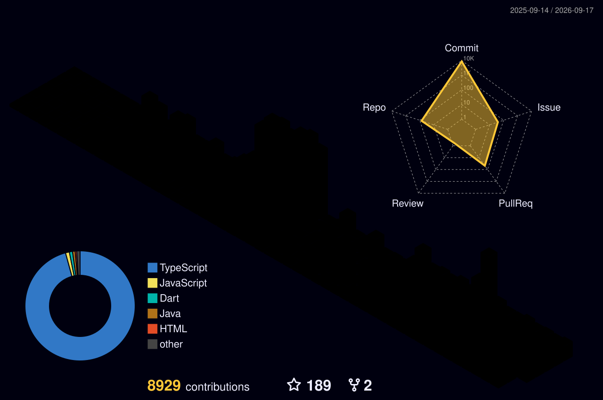

  

  

  

    
    
    
    
  

## 👨‍💻 About Me

- I'm **Mai Tam (`@maitamdev`)**, a software engineering student and full-stack developer from Vietnam.
- I build **web apps, mobile products, AI-powered tools and practical open-source projects**.
- My current work combines **Next.js, TypeScript, Supabase, Groq AI and Solana Devnet**.
- I'm part of **ANTISCAM VN**, with a strong interest in safer and more useful digital products.
- I care about code that is **clear, secure, scalable and actually usable** — not just impressive in a demo.
- I'm open to collaborating on meaningful open-source, startup and student innovation projects.
- ⚡ Fun fact: finding the bug is satisfying; shipping the fix is even better.

### What I'm building now

- 🔐 **[SafeReturn / FindBack](https://github.com/maitamdev/safe-return)** — transparent lost-item bounties backed by Solana Devnet escrow, realtime data and AI-assisted evidence review.
- 🏪 **[Sora POS V2](https://github.com/maitamdev/SORA-POS-V2)** — a full-stack retail POS with inventory automation, role-based access and Groq-powered business insights.

 

---

  <h2>📊 Profile Snapshot</h2>
  

    
    
    
  

  

    
    
  

---

  <h2>🧰 Engineering Toolbox</h2>
  
    
  
  
  
  

---

## 🚀 Selected Work

| Project | Product | Core stack | Links |
|---|---|---|---|
| **SafeReturn / FindBack** | AI-assisted lost-and-found platform with real Solana Devnet escrow and realtime metadata. | Next.js, TypeScript, Supabase, Solana, Groq | [Code](https://github.com/maitamdev/safe-return) · [Live](https://safereturn-delta.vercel.app) |
| **Sora POS V2** | Retail POS, inventory tracking, RBAC, analytics and AI-powered restocking suggestions. | React, Node.js, Express, PostgreSQL, Groq | [Code](https://github.com/maitamdev/SORA-POS-V2) · [Live](https://sora-pos.vercel.app) |
| **DHV Guiding Light** | Mentorship platform connecting DHV students and advisors through booking, dashboards and guidance tools. | React, TypeScript, Firebase, Node.js | [Code](https://github.com/maitamdev/DHV-GUIDING-LIGHT) · [Live](https://dhv-guiding-light.vercel.app) |
| **SCS GO** | Smart EV charging-station discovery, recommendations, booking and operator management. | React, TypeScript, Flutter, Supabase | [Code](https://github.com/maitamdev/s-c-th-ng-minh) |
| **UML Gen** | Generates editable UML diagrams from natural-language prompts with multiple export formats. | TypeScript, Vite, Mermaid, Groq | [Code](https://github.com/maitamdev/uml-gen) |

  

---

  <h2>📈 GitHub Activity</h2>
  

   

  
  

   

  
  
  

  

  

---

## 🌱 My Code Garden

<picture>
  <source media="(prefers-color-scheme: dark)" srcset="https://raw.githubusercontent.com/maitamdev/maitamdev/refs/heads/output/github-snake-dark.svg" />
  <source media="(prefers-color-scheme: light)" srcset="https://raw.githubusercontent.com/maitamdev/maitamdev/refs/heads/output/github-snake.svg" />
  
</picture>

  
<b>🟡 Open the bonus Pac-Man contribution graph</b>

   
  <picture>
    <source media="(prefers-color-scheme: dark)" srcset="https://raw.githubusercontent.com/maitamdev/maitamdev/refs/heads/output/pacman-contribution-graph-dark.svg" />
    <source media="(prefers-color-scheme: light)" srcset="https://raw.githubusercontent.com/maitamdev/maitamdev/refs/heads/output/pacman-contribution-graph.svg" />
    
  </picture>

---

<table>
  <tr>
    <td width="55%" valign="top">
      <h2>🐾 Git Animals</h2>
      
    </td>
    <td width="45%" valign="top" align="center">
      <h2>🎮 Fun Zone</h2>
      
<b>Take on my WebAssembly-powered 2048 game.</b>

      
        
      <a href="https://github.com/maitamdev/2048-ai">View the source code →</a>
    </td>
  </tr>
</table>

  

---

  <h2>🤝 Let's Build Something Useful</h2>
  
I'm open to conversations about open-source, AI products, student innovation and full-stack collaboration.

  

    
    
    
    
    
  

  
  Crafted with curiosity, care and a lot of debugging — © 2026 MaiTamDev

